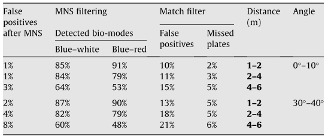

## An edge-based color-aided method for license plate detection (2008 - Elsevier)

    Focus: Iranian license plates. 

They researched on two major areas: to enhance image contrast in plate-like regions, and a novel match filter to eliminate non-plate like regions. Their approach was referenced in many papers. 

